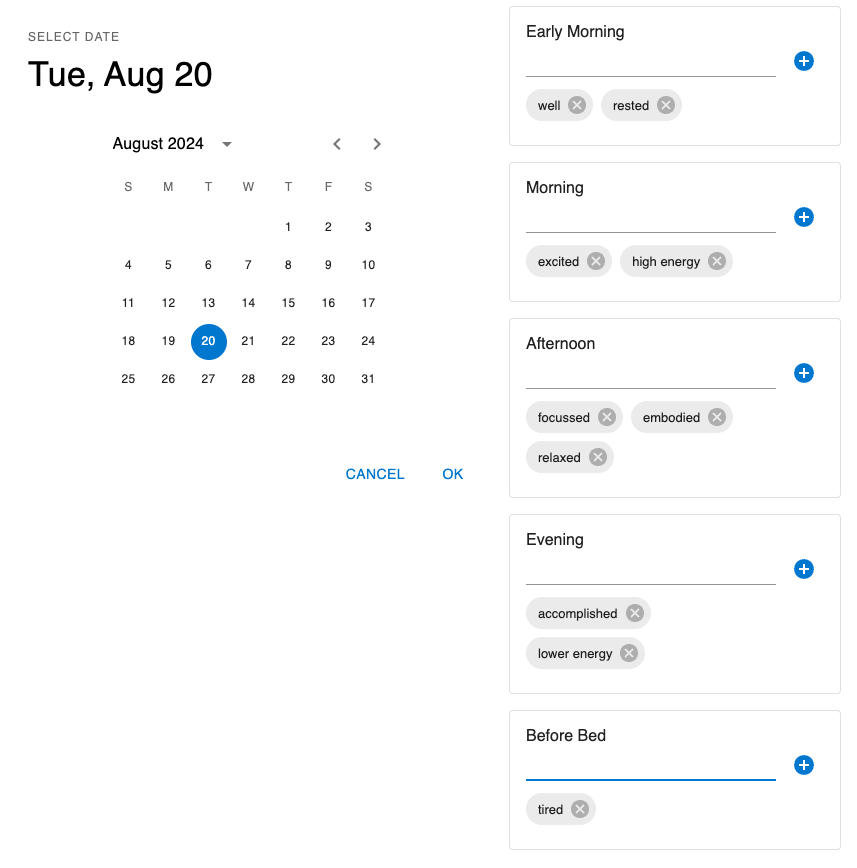

# Emotion Tracker

## Table of Contents
- [Who](#who)
- [What](#what)
  - [Languages, Frameworks, & Competencies](#languages-frameworks--competencies)
- [Why](#why)
- [How - AI-Assisted Coding](#how---ai-assisted-coding)
- [How - Setup and Run](#how---setup-and-run)
- [How - Project Creation](#how---project-creation)
- [Issues and Next TODOs](#issues-and-Next-TODOs)
- [Dev Docs/Guides](#dev-docsguides)
     - [Front-End](#front-end)
     - [Backend](#backend)
     - [DB](#db)
- [Significant Next Steps](#significant-next-steps)
- [License](#license)

### Who
My name is Saad Shakil, I'm a Software Engineer currently located in Ottawa, ON. See the links below for my career bio, resume, and LinkedIn.
- [Career bio/cover letter](https://sshakil.github.io)
- [Resume](https://github.com/sshakil/sshakil.github.io/blob/master/Saad-Shakil-Resume-August-2024-No-Address.pdf)
- [LinkedIn](https://www.linkedin.com/in/saadshakil/)

### What
- **Emotion Tracking**: Provides a calendar date picker and a custom form to track emotions through the various periods of the day.
- **Web App**: A pet project in [Ruby on Rails (RoR)](https://rubyonrails.org/), [ReactJS](https://react.dev/), [MUI](https://mui.com/x/react-date-pickers/date-picker/), and MUI X.
- **Keyboard Navigation**: Supports keyboard tab/shift-tab traversal, backspace/delete, and enter key functionality.

#### Languages, Frameworks, & Competencies
- **Languages** 
  - Ruby
  - JavaScript
  - SQL
- **Frameworks** 
  - Ruby on Rails
  - React
  - Redux
- **Competencies**
  - OAuth 2.0 Authentication: Doorkeeper, Devise
  - RESTful API Design
  - Database Management
  - Containerization
  - Front-end State Management
  - Environment Configuration
  - Bundling and Asset Management

[Back to Top](#emotion-tracker)
### Why
I started this in March 2022, paused while I was in grad school, and resumed as of summer 2024.
- **Skill Maintenance & Demonstration**: I started this a couple of years ago as a means to keep my coding skills alive upon taking a break from full-time work and pursuing graduate studies.
- **Re-familiarization**: Upon my graduation with a [Master's in Engineering, Management](https://catalogue.uottawa.ca/en/graduate/master-engineering-engineering-management/#Requirementstext) (similar to an MBA) in June 2024, I resumed working on this part-time to refamiliarize myself with full-stack web application development through the MVP framework.
- **Enjoyment**: Also, I just find coding enjoyable, especially more so now with AI making it easier and more effective in some ways!

[Back to Top](#emotion-tracker)
### Demo
Full video demo coming soon.

#### Screenshot


[Back to Top](#emotion-tracker)
## How - AI-Assisted Coding
<p>
   Later in the project, I experimented with the usage of:
   <ul>
      <li><a href="https://chat.openai.com/" target="_blank">ChatGPT Plus</a></li>
      <li><a href="https://www.jetbrains.com/help/idea/ai-assistant.html" target="_blank">JetBrains's AI Assistant</a></li>
      <li><a href="https://github.com/kicoe/CodeGPT" target="_blank">CodeGPT plugin</a> in <a href="https://www.jetbrains.com/" target="_blank">JetBrains IDEs</a> (including <a href="https://www.jetbrains.com/ruby/" target="_blank">RubyMine</a>, <a href="https://www.jetbrains.com/webstorm/" target="_blank">WebStorm</a>, and <a href="https://www.jetbrains.com/pycharm/" target="_blank">PyCharm</a> that I use)</li>
      <li><a href="https://github.com/TheR1D/shell_gpt" target="_blank">the Shell GPT plugin</a> on <a href="https://iterm2.com/" target="_blank">iTerm2</a> with <a href="https://www.zsh.org/" target="_blank">Zsh</a></li>
      <li><a href="https://github.com/features/copilot" target="_blank">Co-Pilot</a></li>
      <li><a href="https://blog.google/technology/ai/next-generation-ai-for-google-and-developers/" target="_blank">Gemini Advanced</a></li>
   </ul>
</p>

### Current Preference
<p>
   I found myself using the MacOS native ChatGPT app the most due to the ability to resume particular conversations with most accurate context enrichment (even though it has cross-session memory). The AI Assistant was also fairly good as it provided great commit messages and offered code changes that could be incorporated more directly within the IDEs.
</p>

### Learning Opportunity
<p>
   I've learned a few things along the way about how to effectively use AI in aiding development of this app along with doing data-transormation heavy coding with <a href="https://www.r-project.org/" target="_blank">R</a> for the Data Science course I took, along with my experience using AI effectively and ethically for several other courses (todo: blog article[s]). For example, when repeated prompts are unable to achieve a desired result, including "try a different approach" often gets it to backtrack and get it right.
</p>

### Privacy and Ethics
<p>
   As it's a passion pet project for practicing coding, I didn't mind letting ChatGPT (Plus) have full knowledge of my code. For business use, I would only use an enterprise account which wouldn't be training their models, with maybe a system hook to scrub buffers to ensure copy-paste doesn't accidently transfer sensitive stuff (todo: experiment with this).
</p>

[Back to Top](#emotion-tracker)

## How - Setup and Run
<p>
   This assumes you can use MacOS package manager <code>brew</code> on the CLI to install <code>postgresql</code> and <code>git</code>, update RubyGems(<code>gem</code>) to install </code>bundler</code>, Ruby on Rails, and <code>npm</code> to install MUI, among other libraries.
</p>

### Clone the Repo

```
git clone git@github.com:sshakil/emotion-tracker.git
```

### Change Directory to emotion-tracker

```
cd emotion-tracker
```
<p>
   As it's an RoR project which typically starts from the Model layer in the Model-View-Controller (MVP) approach and goes up, let's setup the DB first.
</p>

[Back to Top](#emotion-tracker)

### Database Setup
#### Start PostgreSQL
As system daemon

```
brew services start postgresql@15
```
Or, manually
```
pg_ctl -D /usr/local/var/postgres start
```

#### Create Databases, User, and grant Privileges
This creates the development and test databases, creates the user 'demo' and grants it all privileges (create schema, read, write, etc).
The first two GRANTs didn't work for `rails db:migrate` (run later), as likely one or both of the last two were needed. Leaving in to maybe investigate later.

```
createdb emotion_tracker
createdb emotion_tracker_test
psql -d emotion_tracker
psql -d emotion_tracker -c "CREATE USER demo WITH PASSWORD P@ssword!1;"
psql -d emotion_tracker -c "GRANT ALL PRIVILEGES ON DATABASE emotion_tracker TO demo;"
psql -d emotion_tracker -c "GRANT ALL PRIVILEGES ON SCHEMA public TO demo;"
psql -d emotion_tracker -c "ALTER SCHEMA public OWNER TO demo;"
psql -d emotion_tracker -c "GRANT CREATE ON SCHEMA public TO demo;"
psql -d emotion_tracker -c "ALTER DATABASE emotion_tracker OWNER TO demo;"
```
#### Create Schema and Seed Data<
This is done before starting the Rails server and attempting to load the app as current date seed will clash due to current setup (todo: check if seed date is needed/remove it):

```
rails db:migrate
rails db:seed
```

[Back to Top](#emotion-tracker)

### Front-End Setup
Install Javascript libraries

```
npm install
```

### Backend Setup

Install Gems

```
bundle install
```

[Back to Top](#emotion-tracker)

### Run

#### Backend

```
rails s -p 3000
```
#### Front-End

```
npx webpack --watch --config ./webpack.config.js
```

#### Load the App

Visit: <a href="http://127.0.0.1:3000/" target="_blank">http://127.0.0.1:3000/</a>

[Back to Top](#emotion-tracker)

## How - Project Creation

Started with Yarn and SQLite then switched to npm and PostgreSQL later.
This is just some of the how. I may add more granular details, for my own records as well, from my CLI history.
```
https://www.freecodecamp.org/news/how-to-create-a-rails-project-with-a-react-and-redux-front-end-8b01e17a1db/

brew install node
npx create-react-app my-app --template typescript
cd emotion-tracker-front
git branch -M main
echo "\n.idea" >> .gitignore
git add .
git commit -m "init + gitignore"
git remote add origin git@github.com:sshakil/emotion-tracker-front-end.git
git push -u origin main

yarn add react_ujs
yarn add react-dom
yarn add react

https://gorails.com/forum/error-in-chunk-application-entry-js-name-contenthash-js-cannot-use-chunkhash-or-contenthash-for-chunk-in
config/webpack/development.js
add:
const config = environment.toWebpackConfig();
config.output.filename = "js/[name]-[hash].js

# diverged here with ChatGPT here

```

[Back to Top](#emotion-tracker)

### Issues and Next TODOs
<p>
    Formatted date conversion issue
</p>

```
return (
   <StaticDatePicker
     orientation="portrait"
     openTo="day"
     value={ convertDateStringToDate(selectedDate) }
     onChange={ (newSelectedDate) => {
         // todo - these strips timezone info, which will be added back later
         // const date = newValue.toISOString().split('T')[0] - this one has a day ahead issue
         // const formattedDate = newSelectedDate.toLocaleDateString()
         // backend needs format: "2022-10-01" (oct 1); front with toLocaleDateString() gives mm/dd/yyyy
         // this converts it to needed format
         // https://stackoverflow.com/questions/23593052/format-javascript-date-as-yyyy-mm-dd
         // should be done on server side?
         const date = convertToYYYYMMDD(newSelectedDate)
         // console.log("StaticDatePicker - onChange: newSelectedDate, formattedDate: ", newSelectedDate, formattedDate)
         console.log("onChange: ", date)
         dispatch(fetchDayIfNotInStore(date))
         dispatch(setSelectedDate(date))
       }
     }
     renderInput={ (params) => <TextField { ...params } /> }
   />
);
```

<p>
    Emotion/Entry cards popping issue
</p>

<p>
    [Fixed] <strike>Newly entered entries not showing for newly selected date until refresh</strike>  
</p>

<p>
    <strike>Focus not on TextField upon using mouse to delete card</strike>
</p>

<p>
    TextField jumps forward and back
</p>

<p>
    Hot reload through <code>HotModuleReplacementPlugin</code> and <code>ReactRefreshWebpackPlugin</code> currently not working through <code>npm start</code> and the script in <code>package.json</code>. Intuitively, this may be due to the nature of <code>EmotionTracker.js</code> in combination with component HMR being too brittle.
</p>


[Back to Top](#emotion-tracker)

## Dev Docs/Guides

### Front-End
App layout starts in <code>/emotion-tracker/app/javascript/components/App.js</code>.

<code>App</code> references <code>Day</code>, which is a <code>Grid</code> containing 2 Grids containing <code>Calendar</code> and <code>EmotionTracker</code>.

<code>EmotionTracker</code> is rendered through <code>renderDayForm</code>, which renders a <code>Stack</code> of <code>Card</code>'s through <code>renderPeriod</code>.

Each <code>Card</code> contains <code>CardContent</code> which wraps:
- <code>Typography</code> to display period name, <TextField>
- <code>TextField</code> to input emotion/affect
- <code>IconButton</code> to allow using the mouse to add the value 

TODO: expand

### Backend
<code>Entries</code> is what connects a <code>day_period</code> with an <code>emotion</code>

TODO: expand

### DB
Started switching to PG on 19/08/2024.

TODO: Expand

[Back to Top](#emotion-tracker)

## Significant Next Steps
<p>
The following items in this order would isolate all the required changes on the infrastructure side to more or less one go.
</p>

1. [OAuth2 - done, UAM - todo] Identity/User Account Management (Authentication and Authorization)
2. Testing (including pen/sec), Continuous Integration, Continuous Deployment
3. [Experiment - done, Implementation - todo] Data Analytics using AI
4. [done] <strike>Containerization</strike> & Deployment to Cloud (AWS)

<p>
However, since I'd like to demonstrate the app ASAP, I'll be proceeding with #4, then 1, 3, and 2.
</p>
<p>
Though I didn't proceed with TDD/BDD, it's something I would prefer to do at orgs for greenfield as well as existing projects.
</p>

[Back to Top](#emotion-tracker)

## License

© 2024 Saad Shakil. All rights reserved.

This project is licensed under a private license for educational purposes and the author's skill-set evaluation for job or contract applications only. You may use, modify, and learn from the code provided here solely for your personal educational use or the evaluation of the author's skill-set during a job or contract application process. Redistribution, commercial use, or privately sharing of this code for any other purpose than identified or sharing it publicly in any form for any purpose is strictly prohibited without explicit permission from the author.

### Key Points:
- **Skill-set Evaluation**: The code may be used to evaluate the author's skill-set during job or contract application processes.
- **Educational Use**: The code may be used for private learning and educational purposes. It cannot be used for commercial purposes or shared with others.
- **Attribution**: If referencing the code within private only for educational use or in evaluations (e.g., in private communications during a job/contract application), you must give appropriate credit to the original author, Saad Shakil.
- **Non-Releasable**: The code cannot be released or distributed privately for any other purpose than listed or publicly for any purpose in any form without explicit permission.
- **Non-Harm/Indemnity**: By using this code for private educational purposes or in skill-set evaluations, you agree to indemnify and hold harmless the author, Saad Shakil, from any claims, damages, or liabilities arising from its use. This includes, but is not limited to, any issues related to the functionality, reliability, or performance of the code in your own or third-party environments.

For any questions or permissions, please contact [Saad Shakil](mailto:saadshakil@gmail.com).

[Back to Top](#emotion-tracker)