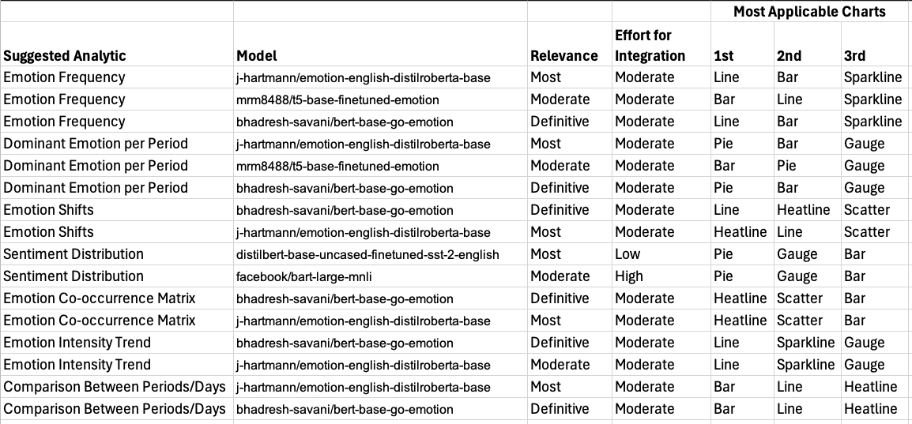
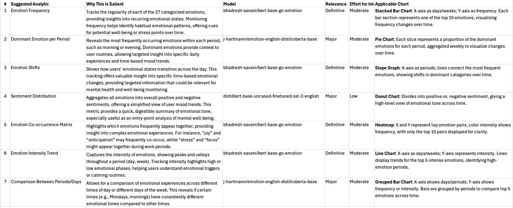

knowing what you know about the EmotionTracker project, what model from Hugging Face would you recommend and what sorts of analytics?

For the EmotionTracker project, leveraging a model that specializes in sentiment analysis or emotion detection would be ideal. Here are some recommendations and the types of analytics you could consider:

 Model Recommendations

 	1.	distilbert-base-uncased-finetuned-sst-2-english: This is a fine-tuned version of DistilBERT for sentiment analysis, which can categorize text into positive or negative sentiments. While not specifically trained on nuanced emotions, it’s lightweight and effective for basic sentiment classification.
 	2.	j-hartmann/emotion-english-distilroberta-base: This model was fine-tuned for multi-label emotion classification and can identify a range of emotions like joy, sadness, anger, and fear, which could be aligned with the emotions tracked in your project.
 	3.	mrm8488/t5-base-finetuned-emotion: This T5-based model is trained on a variety of emotions and can provide more nuanced classifications for text. It supports multiple emotions per input, which might suit cases where entries contain complex emotional states.
 	4.	facebook/bart-large-mnli (for zero-shot classification): If you want to identify emotions without explicitly training on emotional data, zero-shot classification can provide an adaptable solution. You could define custom emotion labels like “calm,” “excited,” or “anxious” and see how the model classifies the entries.

 Suggested Analytics for EmotionTracker

 	1.	Emotion Frequency: Track how often each emotion appears across different periods (morning, afternoon, evening). You could visualize this as a time series to see emotional trends over days, weeks, or months.
 	2.	Dominant Emotion per Period: Identify which emotions are most common for each period (e.g., Morning, Evening) and observe if there are patterns in specific time frames.
 	3.	Emotion Shifts: Measure changes in dominant emotions throughout the day or week. For example, track how the user’s emotional state transitions from morning to evening or Monday to Friday.
 	4.	Sentiment Distribution: If using a binary sentiment model, visualize the distribution of positive and negative sentiments. This could be helpful for an overall mood analysis.
 	5.	Emotion Co-occurrence Matrix: Calculate how often certain emotions appear together, which can give insights into complex emotional states (e.g., feeling both “happy” and “anxious” in the same period).
 	6.	Emotion Intensity Trend: If the model supports intensity scoring (e.g., some emotions models provide a probability score), you could track intensity trends to determine when emotions are more pronounced.
 	7.	Comparison Between Periods/Days: Highlight if certain days (e.g., weekends) or periods of the day (morning vs. night) have significantly different emotional tones.

 These analytics can provide a robust understanding of the user’s emotional patterns over time, enhancing the utility and insights offered by EmotionTracker. Let me know if you’d like further details on setting up any specific model or analytical approach!

 emotion-english-distilroberta-base has 7 and t5-base-finetuned-emotion has 6 emotions they classify into. what're some models that can classify into higher number of emotions?

 If you’re looking for models that classify text into a broader range of emotions, here are some options with more than 7 categories, each offering more nuanced emotional classification:

 1. GoEmotions by Google Research

 	•	Model: monologg/bert-base-cased-goemotions-original
 	•	Emotion Classes: 27 emotion labels, including empathy, gratitude, pride, relief, curiosity, and more.
 	•	Description: GoEmotions is one of the most comprehensive emotion datasets available, covering a wide range of nuanced emotional states. It’s based on BERT and supports multi-label classification, which means a single entry can be tagged with multiple emotions.
 	•	Use Case: Ideal if you need fine-grained emotional analysis and want to capture more specific feelings beyond basic emotions.

 2. EmotionX by AI Research Lab (Taiwan)

 	•	Model: bhadresh-savani/Emotion-Classification-XLNET
 	•	Emotion Classes: 8 basic emotions (plus a neutral category): anger, anticipation, disgust, fear, joy, sadness, surprise, and trust.
 	•	Description: This XLNet-based model is fine-tuned to identify the 8 core Plutchik emotions, which are often used in psychology for a well-rounded view of human emotions. Though not as broad as GoEmotions, it’s more detailed than typical sentiment models.
 	•	Use Case: Good for applications where a stable set of primary emotions is needed without overwhelming detail.

 3. DeepMoji

 	•	Model: Not directly available on Hugging Face, but there are similar models (j-hartmann/emotion-english-distilroberta-base trained for emotion).
 	•	Emotion Classes: 64 emoji-based categories representing a broad range of nuanced emotions.
 	•	Description: DeepMoji was initially developed for emoji prediction based on text, but each emoji is mapped to specific emotional categories. Although more abstract, it covers a wide array of nuanced emotions.
 	•	Use Case: Best for social media or informal text, where emotions are often complex and nuanced.

 4. SentiStrength for Emotion Detection (via Adaptation)

 	•	Model: Not on Hugging Face, but you can implement a multi-label classification layer on top of SentiStrength’s lexicon to expand emotion categories.
 	•	Emotion Classes: User-defined based on lexicon, potentially mapping into 20+ emotions.
 	•	Description: SentiStrength was originally a sentiment analysis tool that analyzes the strength of positive and negative sentiments. By expanding its dictionary, it’s possible to adapt it for a wide range of nuanced emotions.

 5. Unified Language Model for Social Media (ULMFiT) with Emotion Classification

 	•	Model: ULMFiT is a flexible model that can be fine-tuned on specific datasets, including GoEmotions or similar multi-emotion datasets.
 	•	Emotion Classes: Configurable based on training data, e.g., GoEmotions for 27 classes or custom datasets for specific needs.
 	•	Description: ULMFiT is a versatile model that can be adapted to any dataset with emotion tags. By using a fine-tuning approach, you can customize the number and specificity of emotion labels.
 	•	Use Case: Ideal if you want a fully customized solution with specific emotion labels.

 Consideration for Custom Models on Hugging Face

 If you need a model with a specific set of emotional categories, you can fine-tune a model like RoBERTa or BERT on a custom emotion dataset or create a custom emotion classification dataset. For instance, if you build a dataset with 15 or 20 emotion categories, you can fine-tune a general-purpose transformer model to classify into those categories.

 For EmotionTracker, GoEmotions (monologg/bert-base-cased-goemotions-original) is likely the best choice if you want a higher range of emotions (27 categories), as it’s well-optimized for multi-label emotion detection and includes many nuanced emotions that could be useful for comprehensive emotion tracking. Let me know if you’d like assistance with fine-tuning or using any of these models!

Suggested Analytics for EmotionTracker

Emotion Frequency: Track how often each emotion appears across different periods (morning, afternoon, evening). You could visualize this as a time series to see emotional trends over days, weeks, or months.

Dominant Emotion per Period: Identify which emotions are most common for each period (e.g., Morning, Evening) and observe if there are patterns in specific time frames.

Emotion Shifts: Measure changes in dominant emotions throughout the day or week. For example, track how the user’s emotional state transitions from morning to evening or Monday to Friday.

Sentiment Distribution: If using a binary sentiment model, visualize the distribution of positive and negative sentiments. This could be helpful for an overall mood analysis.

Emotion Co-occurrence Matrix: Calculate how often certain emotions appear together, which can give insights into complex emotional states (e.g., feeling both “happy” and “anxious” in the same period).

Emotion Intensity Trend: If the model supports intensity scoring (e.g., some emotions models provide a probability score), you could track intensity trends to determine when emotions are more pronounced.

Comparison Between Periods/Days: Highlight if certain days (e.g., weekends) or periods of the day (morning vs. night) have significantly different emotional tones.

Enhanced Justification of Chart Choices

Emotion Frequency (Stacked Bar Chart):
X-axis: Days or weeks, allowing for a longitudinal view.
Y-axis: Displays frequency, showing trends in how often each of the 27 top emotions appears.
Stacked Sections: Each section represents one of the top 10 most common emotions, helping users identify which emotions recur most frequently and if there are any time-based patterns.

Dominant Emotion per Period (Pie Chart):
Slices: Each slice shows the proportion of dominant emotions per period, providing a snapshot of the emotional tone in specific parts of the day.
Weekly Aggregation: Aggregating over a week helps visualize recurring emotional patterns without daily fluctuations, highlighting stable trends over time.

Emotion Shifts (Slope Graph):
X-axis: Represents periods (e.g., Early Morning, Morning, etc.), allowing a clear view of shifts.
Lines: Each line shows the transition of a single emotion, identifying how emotional states change across time periods within a day.

Sentiment Distribution (Donut Chart):
Two Segments: Positive and negative, providing a high-level overview of the overall sentiment balance.
Aggregated Daily or Weekly: Helps identify trends in general mood without drilling down into specific emotions, useful for quick checks on well-being.

Emotion Co-occurrence Matrix (Heatmap):                                     
X and Y Axes: Represent pairs of emotions within the top 10 co-occurring pairs, keeping data manageable.
Color Intensity: Indicates the frequency of co-occurrences, helping identify which emotions commonly appear together, giving insight into complex emotional states.

Emotion Intensity Trend (Line Chart):
X-axis: Represents days or weeks, tracking shifts in intensity over time.
Y-axis: Shows intensity of the top 5 emotions, helping identify when emotions are more intense and recognizing potentially stressful or uplifting patterns.

Comparison Between Periods/Days (Grouped Bar Chart):
X-axis: Days or periods, allowing for a comparison across time.
Y-axis: Frequency or intensity of emotions, grouped by periods. Shows variations across time frames, helping to pinpoint when certain emotions are more prevalent, potentially correlating with specific times.